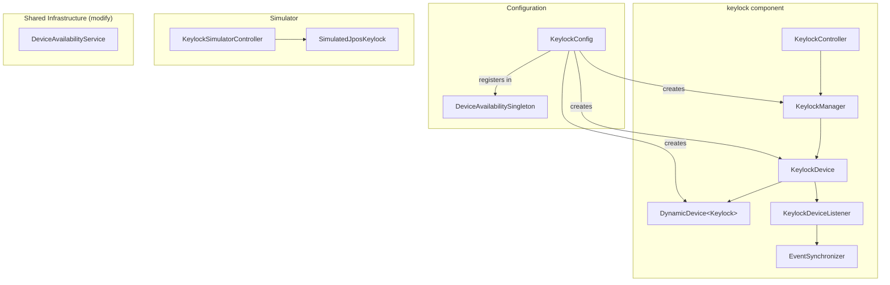

# Add Keylock Device Support to POSSUM

## Important: Adapting the Guide to POSSUM's Actual Patterns

The provided guide describes the general idea well, but its code does **not** match POSSUM's actual architecture. Key differences that the implementation must account for:

- `**DynamicDevice**` manages connection lifecycle via `DeviceConnector` -- devices do NOT call `open()`/`claim()`/`close()` directly. The `connect()` method on Device classes delegates to `DynamicDevice.connect()`.
- `**DeviceHealthResponse**` takes `(String deviceName, DeviceHealth enumValue)` in its constructor -- there are no `setIsConnected()`, `addDeviceStatus()`, or `setHealthStatus(String)` methods.
- `**DeviceException**` takes either `(DeviceError)` or `(JposException)` -- there is no `(DeviceError, String)` constructor.
- **There is no Angular frontend** in this repo. POSSUM is a backend-only Spring Boot REST API. Frontend code from the guide is out of scope.
- **Each device uses a `DeviceListener**` (with `EventSynchronizer` and `Phaser`) for event synchronization, not raw `Consumer<T>` callbacks.
- **All classes use `@Profile({"local", "dev", "prod"})**` annotations.
- **Logging uses `StructuredEventLogger**`, not `System.err.println`.

## Architecture




## Files to Create

All new files go under `src/main/java/com/target/devicemanager/components/keylock/`.

### 1. `KeylockDevice.java` -- Device wrapper

Modeled after `[CashDrawerDevice.java](src/main/java/com/target/devicemanager/components/cashdrawer/CashDrawerDevice.java)`:

- Wraps `DynamicDevice<? extends Keylock>` and a `DeviceListener`
- Implements `StatusUpdateListener` for key position changes
- `connect()` delegates to `dynamicKeylock.connect()`, attaches listeners, enables device, reads initial `getKeyPosition()`
- `disconnect()` detaches listeners, disables device, delegates to `dynamicKeylock.disconnect()`
- `statusUpdateOccurred()` handles `KeylockConst.LOCK_KP_LOCK`, `LOCK_KP_NORM`, `LOCK_KP_SUPR` and power events
- Tracks `currentPosition` (int) and `deviceConnected` (boolean)
- `getKeyPosition()` returns current cached position
- Uses `ReentrantLock` for `tryLock()`/`unlock()` pattern

### 2. `KeylockDeviceListener.java` -- Event listener

Modeled after `[CashDrawerDeviceListener.java](src/main/java/com/target/devicemanager/components/cashdrawer/CashDrawerDeviceListener.java)`:

- Extends `DeviceListener`
- Overrides `isFailureStatus(int status)` to return `false` for key position change events and `JPOS_PS_ONLINE`

### 3. `KeylockManager.java` -- Business logic / thread-safety

Modeled after `[CashDrawerManager.java](src/main/java/com/target/devicemanager/components/cashdrawer/CashDrawerManager.java)`:

- Takes `KeylockDevice` and `Lock` in constructor
- `@Scheduled(fixedDelay = 5000)` `connect()` method for auto-reconnection
- `reconnectDevice()` with lock
- `getKeyPosition()` returns `KeylockPosition` enum from device
- `getHealth()` / `getStatus()` using `CacheManager`

### 4. `KeylockController.java` -- REST endpoints

Modeled after `[CashDrawerController.java](src/main/java/com/target/devicemanager/components/cashdrawer/CashDrawerController.java)`:

- `@RestController` at `/v1/keylock`
- `GET /position` -- returns current `KeylockPosition`
- `POST /reconnect` -- reconnects device
- `GET /health` -- returns `DeviceHealthResponse`
- `GET /healthstatus` -- returns cached health
- Swagger `@Operation` / `@ApiResponses` annotations
- `StructuredEventLogger` for request/response logging

### 5. `KeylockConfig.java` -- Spring configuration

Modeled after `[CashDrawerConfig.java](src/main/java/com/target/devicemanager/components/cashdrawer/CashDrawerConfig.java)`:

- `@Configuration` with `@Profile({"local", "dev", "prod"})`
- `@Bean` method creates `DynamicDevice<Keylock>` (or `SimulatedDynamicDevice` in sim mode)
- Wires `KeylockDeviceListener` with `EventSynchronizer(new Phaser(1))`
- Creates `KeylockManager` with `KeylockDevice` and `ReentrantLock`
- Registers manager in `DeviceAvailabilitySingleton`

### 6. `entities/KeylockPosition.java` -- Position enum

```java
public enum KeylockPosition {
    LOCKED,
    NORMAL,
    SUPERVISOR,
    UNKNOWN
}
```

### 7. `entities/KeylockError.java` -- Error definitions

Extends `DeviceError` (same pattern as `[CashDrawerError.java](src/main/java/com/target/devicemanager/components/cashdrawer/entities/CashDrawerError.java)`):

- `POSITION_READ_FAILED` -- for when position cannot be read

### 8. `simulator/SimulatedJposKeylock.java` -- Simulated device

Modeled after `[SimulatedJposCashDrawer.java](src/main/java/com/target/devicemanager/components/cashdrawer/simulator/SimulatedJposCashDrawer.java)`:

- Extends `jpos.Keylock`
- Tracks simulated `SimulatorState` and key position
- `setPosition()` fires `StatusUpdateEvent` to listeners
- Overrides `getState()`, `getDeviceEnabled()`, `setDeviceEnabled()`, `getKeyPosition()`

### 9. `simulator/KeylockSimulatorController.java` -- Simulator API

Modeled after `[CashDrawerSimulatorController.java](src/main/java/com/target/devicemanager/components/cashdrawer/simulator/CashDrawerSimulatorController.java)`:

- `@RestController` at `/v1/simulate`, `@Profile("local")`
- `POST /v1/simulate/keylockPosition` -- simulate key turn
- `POST /v1/simulate/keylockState` -- simulate online/offline

### 10. `simulator/KeylockPositionStatus.java` -- Simulator status enum

```java
public enum KeylockPositionStatus {
    LOCKED,
    NORMAL,
    SUPERVISOR
}
```

## Files to Modify

### `[DeviceAvailabilitySingleton.java](src/main/java/com/target/devicemanager/common/DeviceAvailabilitySingleton.java)`

- Add `private KeylockManager keylockManager` field
- Add `getKeylockManager()` / `setKeylockManager()` methods
- Add import for `KeylockManager`

### `[DeviceAvailabilityService.java](src/main/java/com/target/devicemanager/common/DeviceAvailabilityService.java)`

- Add `"keylock"` case in `findDevStatus()` switch
- Add keylock health to `getHealth()` response list

## Tests to Create

Under `src/test/java/com/target/devicemanager/components/keylock/`:

### `KeylockDeviceTest.java`

Following `[CashDrawerDeviceTest.java](src/test/java/com/target/devicemanager/components/cashdrawer/CashDrawerDeviceTest.java)` pattern -- test connect, disconnect, statusUpdateOccurred for each position, lock/unlock, null argument validation.

### `KeylockManagerTest.java`

Test connect scheduling, reconnect, getKeyPosition, getHealth/getStatus with cache.

### `KeylockControllerTest.java`

Test each REST endpoint, verify proper error mapping and logging.