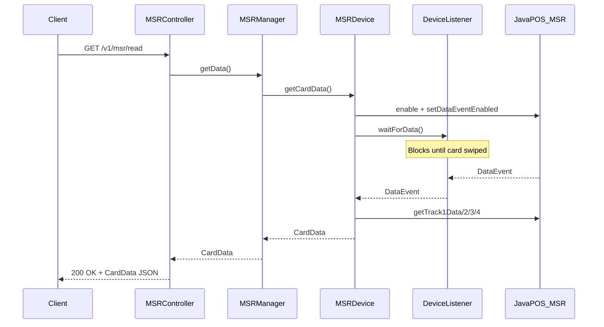

# Add MSR (Magnetic Stripe Reader) Support to POSSUM

## Architecture

The MSR implementation follows the **Scanner pattern** since both are discrete-read devices (client initiates a read, waits for data, receives result). This is fundamentally different from the POS Keyboard (continuous event stream via SSE).

## Key Differences from the Guide

- **No CompletableFuture/async** -- use blocking `DeviceListener.waitForData()` (same as Scanner)
- **No WebSocket/SSE for card data** -- use a blocking HTTP GET endpoint (like `GET /v1/scan`)
- **No Angular frontend** -- backend-only project
- **Uses `StructuredEventLogger**` instead of `System.out.println`
- **Uses `DynamicDevice`/`DeviceConnector**` for device lifecycle (not manual open/claim/enable)
- **Uses `DeviceListener`/`EventSynchronizer**` with `Phaser` for event synchronization

## Files to Create

### Entities (in `src/main/java/.../components/msr/entities/`)

1. **[MSRError.java](src/main/java/com/target/devicemanager/components/msr/entities/MSRError.java)** -- Extends `DeviceError` with MSR-specific errors: `DISABLED`, `ALREADY_DISABLED`. Modeled after [ScannerError.java](src/main/java/com/target/devicemanager/components/scanner/entities/ScannerError.java).
2. **[MSRException.java](src/main/java/com/target/devicemanager/components/msr/entities/MSRException.java)** -- Extends `DeviceException`, maps JposException error codes to MSRErrors. Maps `JPOS_E_DISABLED` -> `DISABLED`, `JPOS_E_TIMEOUT` -> `DISABLED`, `JPOS_E_FAILURE/ILLEGAL` -> `UNEXPECTED_ERROR`, `JPOS_E_CLOSED` -> `DEVICE_OFFLINE`. Modeled after [ScannerException.java](src/main/java/com/target/devicemanager/components/scanner/entities/ScannerException.java).
3. **[CardData.java](src/main/java/com/target/devicemanager/components/msr/entities/CardData.java)** -- Simple POJO for card track data. Fields: `String track1Data`, `String track2Data`, `String track3Data`, `String track4Data`. Modeled after [Barcode.java](src/main/java/com/target/devicemanager/components/scanner/entities/Barcode.java).

### Device Layer (in `src/main/java/.../components/msr/`)

1. **[MSRDevice.java](src/main/java/com/target/devicemanager/components/msr/MSRDevice.java)** -- Core device wrapper. Key methods:
  - `connect()` -- uses `dynamicMSR.connect()`, attaches event listeners
  - `getCardData()` -- calls `enable()` (sets `autoDisable`, `dataEventEnabled`, `deviceEnabled` on the MSR), then `deviceListener.waitForData()` to block until DataEvent, then reads `getTrack1Data()` etc. from the `jpos.MSR` object. Returns `CardData`.
  - `cancelCardData()` -- calls `disable()` then `deviceListener.stopWaitingForData()`
  - `reconnect()` -- disconnect then reconnect using `dynamicMSR`
  - Follows the [ScannerDevice.java](src/main/java/com/target/devicemanager/components/scanner/ScannerDevice.java) pattern exactly.
2. **[MSRDeviceListener.java](src/main/java/com/target/devicemanager/components/msr/MSRDeviceListener.java)** -- Extends `DeviceListener`, overrides `isFailureStatus()` to treat `JPOS_PS_UNKNOWN` and `JPOS_SUE_POWER_ONLINE` as non-failure. Modeled after [ScannerDeviceListener.java](src/main/java/com/target/devicemanager/components/scanner/ScannerDeviceListener.java).

### Manager Layer

1. **[MSRManager.java](src/main/java/com/target/devicemanager/components/msr/MSRManager.java)** -- Thread-safe manager:
  - `getData()` -- acquires lock, calls `msrDevice.getCardData()`, returns `CardData`
  - `cancelReadRequest()` -- cancels pending read (mirrors `ScannerManager.cancelScanRequest()`)
  - `reconnectDevice()` -- calls `msrDevice.reconnect()`
  - `getHealth()` / `getStatus()` -- health management with `CacheManager` ("msrHealth" cache)
  - `@Scheduled connect()` -- auto-reconnect every 5 seconds
  - Simpler than ScannerManager since MSR is a single device (not a list of flatbed/handheld).

### Controller

1. **[MSRController.java](src/main/java/com/target/devicemanager/components/msr/MSRController.java)** -- REST controller at `/v1`:
  - `GET /v1/msr/read` -- blocking endpoint, returns `CardData` when card is swiped
  - `DELETE /v1/msr/read` -- cancels pending read
  - `POST /v1/msr/reconnect` -- reconnects device
  - `GET /v1/msr/health` -- health check
  - `GET /v1/msr/healthstatus` -- cached health status

### Configuration

1. **[MSRConfig.java](src/main/java/com/target/devicemanager/components/msr/MSRConfig.java)** -- Spring `@Configuration`:
  - Creates `DynamicDevice<MSR>` (or `SimulatedDynamicDevice` in simulation mode)
  - Wires `MSRDeviceListener` with `EventSynchronizer(new Phaser(1))`
  - Creates `MSRDevice` and `MSRManager` beans
  - Registers `MSRManager` with `DeviceAvailabilitySingleton`
  - Follows [ScannerConfig.java](src/main/java/com/target/devicemanager/components/scanner/ScannerConfig.java) and [POSKeyboardConfig.java](src/main/java/com/target/devicemanager/components/poskeyboard/POSKeyboardConfig.java) patterns.

### Simulator (in `src/main/java/.../components/msr/simulator/`)

1. **[SimulatedJposMSR.java](src/main/java/com/target/devicemanager/components/msr/simulator/SimulatedJposMSR.java)** -- Extends `jpos.MSR`, provides:
  - Default card data for testing
  - `setCardData(CardData)` to set simulated track data, fires `DataEvent`
  - `setState(SimulatorState)` to change device state, fires `StatusUpdateEvent`
  - Overrides `getTrack1Data()`, `getTrack2Data()`, etc.
  - Modeled after [SimulatedJposScanner.java](src/main/java/com/target/devicemanager/components/scanner/simulator/SimulatedJposScanner.java).
2. **[MSRSimulatorController.java](src/main/java/com/target/devicemanager/components/msr/simulator/MSRSimulatorController.java)** -- REST controller at `/v1/simulate`:
  - `POST /v1/simulate/msr` -- sets card data to trigger a read
    - `POST /v1/simulate/msrState` -- changes device state (ONLINE/OFFLINE)
    - Modeled after [ScanSimulatorController.java](src/main/java/com/target/devicemanager/components/scanner/simulator/ScanSimulatorController.java).

## Files to Modify

1. **[DeviceAvailabilitySingleton.java](src/main/java/com/target/devicemanager/common/DeviceAvailabilitySingleton.java)** -- Add `MSRManager msrManager` field, getter, setter (like the existing `posKeyboardManager` field).
2. **[DeviceAvailabilityService.java](src/main/java/com/target/devicemanager/common/DeviceAvailabilityService.java)** -- Add `"msr"` case to `findDevStatus()` switch and add MSRManager health to `getHealth()` method.
3. **[devcon.xml](src/main/resources/devcon.xml)** -- Add MSR `JposEntry` for the magnetic stripe reader device.

## Test Files to Create (in `src/test/java/.../components/msr/`)

1. **[MSRDeviceTest.java](src/test/java/com/target/devicemanager/components/msr/MSRDeviceTest.java)** -- Tests for connect, getCardData (success/error/cancel), reconnect, tryLock/unlock. Uses Mockito mocks for `DynamicDevice<MSR>`, `DeviceListener`, `MSR`.
2. **[MSRManagerTest.java](src/test/java/com/target/devicemanager/components/msr/MSRManagerTest.java)** -- Tests for getData, cancelReadRequest, reconnect, getHealth/getStatus with cache. Uses Mockito mocks for `MSRDevice`, `Lock`, `CacheManager`.
3. **[MSRControllerTest.java](src/test/java/com/target/devicemanager/components/msr/MSRControllerTest.java)** -- Tests for all controller endpoints. Uses Mockito mock for `MSRManager`.

