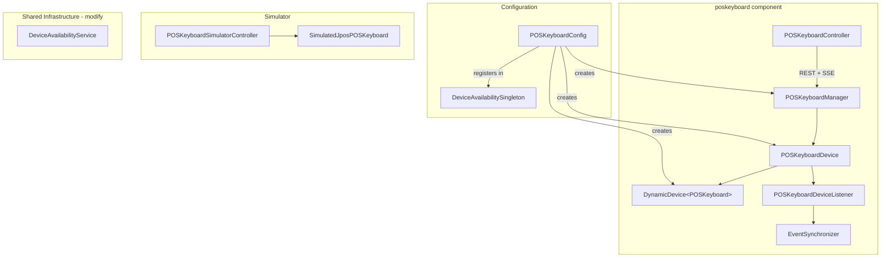
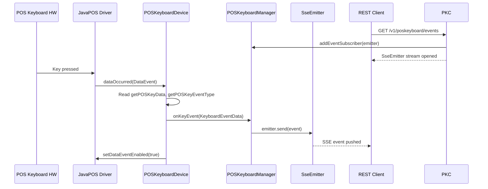

# Add POS Keyboard Support to POSSUM

## Important: Adapting the Guide to POSSUM's Actual Patterns

The provided guide describes the concept well, but its code does **not** match POSSUM's actual architecture. The implementation must follow these established patterns:

- `**DynamicDevice**` manages connection lifecycle via `DeviceConnector` -- devices do NOT call `open()`/`claim()`/`close()` directly
- `**DeviceHealthResponse**` takes `(String deviceName, DeviceHealth enumValue)` -- no `setIsConnected()`, `addDeviceStatus()`, or `setHealthStatus(String)` methods
- `**DeviceException**` takes either `(DeviceError)` or `(JposException)` -- no `(DeviceError, String)` constructor
- **No Angular frontend** -- POSSUM is backend-only; all frontend code from the guide is skipped
- **SSE (SseEmitter)** for real-time event delivery instead of WebSocket/STOMP (already used in `DeviceAvailabilityService`)
- Each device uses a `DeviceListener` (with `EventSynchronizer` and `Phaser`)
- All classes use `@Profile({"local", "dev", "prod"})` annotations
- Logging uses `StructuredEventLogger`, not `System.out.println`
- Per-device `*Config.java` class inside the component package, not a generic `DeviceConfiguration`

## Architecture




### Event Flow (SSE-based)




## Files to Create

All new files under `src/main/java/com/target/devicemanager/components/poskeyboard/`.

### 1. `entities/POSKeyboardError.java`

Modeled after `[KeylockError.java](src/main/java/com/target/devicemanager/components/keylock/entities/KeylockError.java)`:

- Extends `DeviceError`
- `EVENT_READ_FAILED` -- for when key event data cannot be read

### 2. `entities/KeyboardEventData.java`

New POJO to represent a keyboard event:

```java
public class KeyboardEventData {
    private int keyCode;
    private String eventType; // "KEY_DOWN" or "KEY_UP"
    private long timestamp;
    // constructor, getters, toString
}
```

### 3. `POSKeyboardDevice.java` -- Device wrapper

Modeled after `[KeylockDevice.java](src/main/java/com/target/devicemanager/components/keylock/KeylockDevice.java)` and `[ScannerDevice.java](src/main/java/com/target/devicemanager/components/scanner/ScannerDevice.java)`:

- Wraps `DynamicDevice<? extends POSKeyboard>` and a `DeviceListener`
- Implements `DataListener` (for key events) and `StatusUpdateListener` (for power events)
- `connect()` delegates to `dynamicKeyboard.connect()`, attaches listeners, enables device, configures event types via `setEventTypes(POSKeyboardConst.KBD_ET_DOWN_UP)`, enables data events via `setDataEventEnabled(true)`
- `disconnect()` detaches listeners, disables device, delegates to `dynamicKeyboard.disconnect()`
- `dataOccurred(DataEvent)` reads `getPOSKeyData()` and `getPOSKeyEventType()`, creates `KeyboardEventData`, notifies manager via a `Consumer<KeyboardEventData>` callback, re-enables data events
- `statusUpdateOccurred(StatusUpdateEvent)` handles power online/offline events, updates `deviceConnected`
- Uses `ReentrantLock` for `tryLock()`/`unlock()` pattern (same as KeylockDevice)
- Tracks `deviceConnected` boolean and `supportsKeyUp` capability

### 4. `POSKeyboardDeviceListener.java`

Modeled after `[KeylockDeviceListener.java](src/main/java/com/target/devicemanager/components/keylock/KeylockDeviceListener.java)`:

- Extends `DeviceListener`
- Overrides `isFailureStatus(int status)` to return `false` for `JPOS_PS_ONLINE`

### 5. `POSKeyboardManager.java` -- Business logic with SSE

Modeled after `[KeylockManager.java](src/main/java/com/target/devicemanager/components/keylock/KeylockManager.java)`, with SSE subscriber management modeled after `DeviceAvailabilityService.deviceErrorClientList`:

- Takes `POSKeyboardDevice` and `Lock` in constructor
- `@Scheduled(fixedDelay = 5000)` `connect()` method for auto-reconnection
- `reconnectDevice()` with lock
- **SSE subscriber management**: `CopyOnWriteArrayList<SseEmitter>` for connected clients
- `addEventSubscriber(SseEmitter)` / `removeEventSubscriber(SseEmitter)` methods
- `onKeyEvent(KeyboardEventData)` -- callback from device, sends event to all SSE subscribers via `emitter.send()`
- `getHealth()` / `getStatus()` using `CacheManager` (same caching pattern as keylock)
- Registers itself as the event callback on the device

### 6. `POSKeyboardController.java` -- REST endpoints

Modeled after `[KeylockController.java](src/main/java/com/target/devicemanager/components/keylock/KeylockController.java)`:

- `@RestController` at `/v1/poskeyboard`
- `GET /events` (produces `text/event-stream`) -- SSE endpoint that returns `SseEmitter`, registers it with manager, sets up `onCompletion`/`onTimeout` cleanup
- `POST /reconnect` -- reconnects device
- `GET /health` -- returns `DeviceHealthResponse`
- `GET /healthstatus` -- returns cached health
- Swagger `@Operation` / `@ApiResponses` annotations
- `StructuredEventLogger` for request/response logging

### 7. `POSKeyboardConfig.java` -- Spring configuration

Modeled after `[KeylockConfig.java](src/main/java/com/target/devicemanager/components/keylock/KeylockConfig.java)`:

- `@Configuration` with `@Profile({"local", "dev", "prod"})`
- `@Bean` method creates `DynamicDevice<POSKeyboard>` (or `SimulatedDynamicDevice` in sim mode)
- Wires `POSKeyboardDeviceListener` with `EventSynchronizer(new Phaser(1))`
- Creates `POSKeyboardManager` with `POSKeyboardDevice` and `ReentrantLock`
- Registers manager in `DeviceAvailabilitySingleton`
- `@Bean` for `SimulatedJposPOSKeyboard`

### 8. `simulator/SimulatedJposPOSKeyboard.java`

Modeled after `[SimulatedJposKeylock.java](src/main/java/com/target/devicemanager/components/keylock/simulator/SimulatedJposKeylock.java)`:

- Extends `jpos.POSKeyboard`
- Tracks simulated `SimulatorState` and last key press data
- `simulateKeyPress(int keyCode)` fires `DataEvent` to registered DataListeners
- `setState(SimulatorState)` fires `StatusUpdateEvent` to registered StatusUpdateListeners
- Overrides `getState()`, `getDeviceEnabled()`, `setDeviceEnabled()`, `getPOSKeyData()`, `getPOSKeyEventType()`, `getCapKeyUp()`

### 9. `simulator/POSKeyboardSimulatorController.java`

Modeled after `[KeylockSimulatorController.java](src/main/java/com/target/devicemanager/components/keylock/simulator/KeylockSimulatorController.java)`:

- `@RestController` at `/v1/simulate`, `@Profile("local")`
- `POST /v1/simulate/poskeyboardKey` -- simulate a key press (accepts `keyCode` parameter)
- `POST /v1/simulate/poskeyboardState` -- simulate online/offline

## Files to Modify

### `[DeviceAvailabilitySingleton.java](src/main/java/com/target/devicemanager/common/DeviceAvailabilitySingleton.java)`

- Add `private POSKeyboardManager posKeyboardManager` field
- Add `getPosKeyboardManager()` / `setPosKeyboardManager()` methods
- Add import for `POSKeyboardManager`

### `[DeviceAvailabilityService.java](src/main/java/com/target/devicemanager/common/DeviceAvailabilityService.java)`

- Add `"poskeyboard"` case in `findDevStatus()` switch statement
- Add import for `POSKeyboardManager`

### `[devcon.xml](src/main/resources/devcon.xml)`

- Add `JposEntry` for POSKeyboard device (vendor-specific configuration depending on hardware model)

## Tests to Create

Under `src/test/java/com/target/devicemanager/components/poskeyboard/`:

### `POSKeyboardDeviceTest.java`

Following keylock test patterns -- test connect, disconnect, dataOccurred for key events, statusUpdateOccurred for power events, lock/unlock, null argument validation.

### `POSKeyboardManagerTest.java`

Test connect scheduling, reconnect, SSE event delivery (subscribe/unsubscribe/send), getHealth/getStatus with cache.

### `POSKeyboardControllerTest.java`

Test each REST endpoint including SSE subscription, verify proper error mapping and logging.