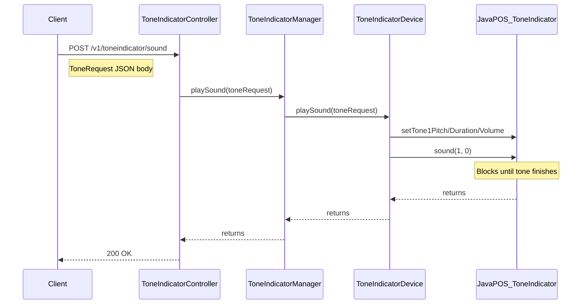

# Add Tone Indicator Support to POSSUM

## Architecture

The Tone Indicator is a command-based output device, closest in pattern to **CashDrawer** (POST to trigger an action). The client sends tone parameters, the device plays the sound synchronously, and the response returns when the tone finishes.

## Key Differences from the Guide

- **No CompletableFuture/async mode management** -- use synchronous `sound()` call (blocks until tone finishes, like CashDrawer blocking until drawer closes)
- **No SoundProfile system** -- POSSUM is a device manager, not an application framework. Tone parameters are passed directly via POST body.
- **No Angular frontend** -- backend-only project
- **Uses `StructuredEventLogger**` instead of `System.out.println`
- **Uses `DynamicDevice`/`DeviceConnector**` for device lifecycle
- **Follows CashDrawer pattern** for the command-based output flow

## Files to Create

### Entities (in `src/main/java/.../components/toneindicator/entities/`)

1. **[ToneIndicatorError.java](src/main/java/com/target/devicemanager/components/toneindicator/entities/ToneIndicatorError.java)** -- Extends `DeviceError` with Tone Indicator-specific errors: `SOUND_FAILED`. Modeled after [CashDrawerError.java](src/main/java/com/target/devicemanager/components/cashdrawer/entities/CashDrawerError.java).
2. **[ToneRequest.java](src/main/java/com/target/devicemanager/components/toneindicator/entities/ToneRequest.java)** -- Simple POJO for tone parameters (like [LineDisplayData.java](src/main/java/com/target/devicemanager/components/linedisplay/entities/LineDisplayData.java)). Fields:
  - `int pitch1` -- frequency in Hz for tone 1 (e.g. 1500)
  - `int duration1` -- duration in ms for tone 1 (e.g. 100)
  - `int volume1` -- volume 0-100 for tone 1 (e.g. 50)
  - `int pitch2` -- frequency in Hz for tone 2 (0 = single tone only)
  - `int duration2` -- duration in ms for tone 2
  - `int volume2` -- volume 0-100 for tone 2
  - `int interToneWait` -- pause in ms between tones

### Device Layer (in `src/main/java/.../components/toneindicator/`)

1. **[ToneIndicatorDevice.java](src/main/java/com/target/devicemanager/components/toneindicator/ToneIndicatorDevice.java)** -- Core device wrapper implementing `StatusUpdateListener`. Key methods:
  - `connect()` -- uses `dynamicToneIndicator.connect()`, attaches listeners, enables device (like [CashDrawerDevice.java](src/main/java/com/target/devicemanager/components/cashdrawer/CashDrawerDevice.java))
  - `disconnect()` -- detaches listeners, disables, disconnects
  - `playSound(ToneRequest)` -- calls `enable()`, then configures `Tone1Pitch/Duration/Volume` (and optionally `Tone2*` + `InterToneWait`), then calls `sound(1, 0)` synchronously. Modeled after `CashDrawerDevice.openCashDrawer()`.
  - `enable()` -- checks `isConnected()`, starts event listeners
  - Standard `tryLock()`/`unlock()`, `statusUpdateOccurred()`, `getDeviceName()`, `isConnected()`
2. **[ToneIndicatorDeviceListener.java](src/main/java/com/target/devicemanager/components/toneindicator/ToneIndicatorDeviceListener.java)** -- Extends `DeviceListener`, overrides `isFailureStatus()` to treat `JPOS_SUE_POWER_ONLINE` as non-failure. Modeled after [CashDrawerDeviceListener.java](src/main/java/com/target/devicemanager/components/cashdrawer/CashDrawerDeviceListener.java).

### Manager Layer

1. **[ToneIndicatorManager.java](src/main/java/com/target/devicemanager/components/toneindicator/ToneIndicatorManager.java)** -- Thread-safe manager:
  - `playSound(ToneRequest)` -- acquires lock, calls `toneIndicatorDevice.playSound()`, releases lock. Follows `CashDrawerManager.openCashDrawer()` pattern.
  - `reconnectDevice()` -- disconnect then reconnect
  - `getHealth()` / `getStatus()` -- health management with `CacheManager` ("toneIndicatorHealth" cache)
  - `@Scheduled connect()` -- auto-reconnect every 5 seconds
  - Follows [CashDrawerManager.java](src/main/java/com/target/devicemanager/components/cashdrawer/CashDrawerManager.java) pattern.

### Controller

1. **[ToneIndicatorController.java](src/main/java/com/target/devicemanager/components/toneindicator/ToneIndicatorController.java)** -- REST controller at `/v1/toneindicator`:
  - `POST /v1/toneindicator/sound` -- plays a tone with `ToneRequest` body (like `POST /v1/cashdrawer/open` and `POST /v1/display`)
  - `POST /v1/toneindicator/reconnect` -- reconnects device
  - `GET /v1/toneindicator/health` -- health check
  - `GET /v1/toneindicator/healthstatus` -- cached health status
  - Follows [CashDrawerController.java](src/main/java/com/target/devicemanager/components/cashdrawer/CashDrawerController.java) pattern.

### Configuration

1. **[ToneIndicatorConfig.java](src/main/java/com/target/devicemanager/components/toneindicator/ToneIndicatorConfig.java)** -- Spring `@Configuration`:
  - Creates `DynamicDevice<ToneIndicator>` (or `SimulatedDynamicDevice` in simulation mode)
  - Wires `ToneIndicatorDeviceListener` with `EventSynchronizer(new Phaser(1))`
  - Creates `ToneIndicatorDevice` and `ToneIndicatorManager` beans
  - Registers `ToneIndicatorManager` with `DeviceAvailabilitySingleton`
  - Follows [CashDrawerConfig.java](src/main/java/com/target/devicemanager/components/cashdrawer/CashDrawerConfig.java) pattern.

### Simulator (in `src/main/java/.../components/toneindicator/simulator/`)

1. **[SimulatedJposToneIndicator.java](src/main/java/com/target/devicemanager/components/toneindicator/simulator/SimulatedJposToneIndicator.java)** -- Extends `jpos.ToneIndicator`:
  - Stores last `ToneRequest` parameters for verification
  - `sound()` fires `StatusUpdateEvent` to simulate playing
  - `setState(SimulatorState)` to change online/offline
  - Overrides `setTone1Pitch()`, `setTone1Duration()`, etc. to store values
  - Modeled after [SimulatedJposCashDrawer.java](src/main/java/com/target/devicemanager/components/cashdrawer/simulator/SimulatedJposCashDrawer.java).
2. **[ToneIndicatorSimulatorController.java](src/main/java/com/target/devicemanager/components/toneindicator/simulator/ToneIndicatorSimulatorController.java)** -- REST controller at `/v1/simulate`:
  - `POST /v1/simulate/toneIndicatorState` -- changes device state (ONLINE/OFFLINE)
  - Modeled after existing simulator controllers.

## Files to Modify

1. **[DeviceAvailabilitySingleton.java](src/main/java/com/target/devicemanager/common/DeviceAvailabilitySingleton.java)** -- Add `ToneIndicatorManager` field, getter, setter.
2. **[DeviceAvailabilityService.java](src/main/java/com/target/devicemanager/common/DeviceAvailabilityService.java)** -- Add `"toneindicator"` case to `findDevStatus()` switch and add ToneIndicatorManager health to `getHealth()` method.
3. **[devcon.xml](src/main/resources/devcon.xml)** -- Add ToneIndicator `JposEntry`.

## Test Files to Create (in `src/test/java/.../components/toneindicator/`)

1. **[ToneIndicatorDeviceTest.java](src/test/java/com/target/devicemanager/components/toneindicator/ToneIndicatorDeviceTest.java)** -- Tests for connect, playSound (success, device offline, JposException), disconnect, tryLock/unlock. Uses Mockito mocks for `DynamicDevice<ToneIndicator>`, `DeviceListener`, `ToneIndicator`.
2. **[ToneIndicatorManagerTest.java](src/test/java/com/target/devicemanager/components/toneindicator/ToneIndicatorManagerTest.java)** -- Tests for playSound, reconnect, getHealth/getStatus with cache. Uses Mockito mocks for `ToneIndicatorDevice`, `Lock`, `CacheManager`.
3. **[ToneIndicatorControllerTest.java](src/test/java/com/target/devicemanager/components/toneindicator/ToneIndicatorControllerTest.java)** -- Tests for all controller endpoints. Uses Mockito mock for `ToneIndicatorManager`.

