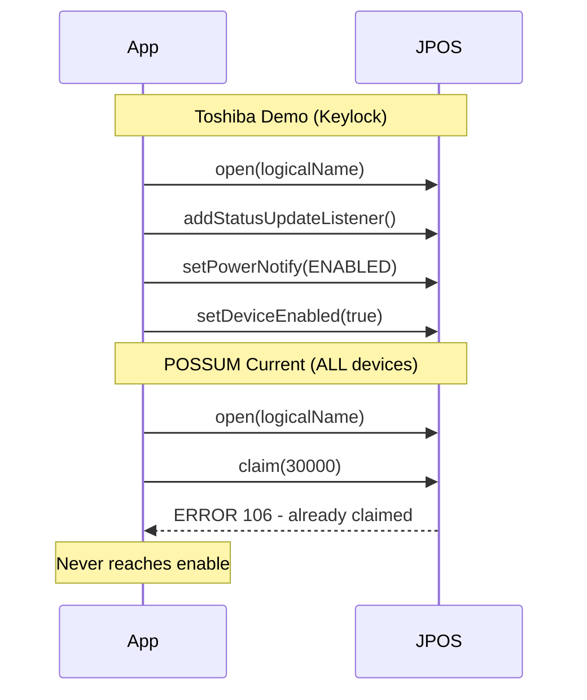

# Fix Keylock: Skip Claim for Shared Devices

## Root Cause

The Toshiba demo code reveals the critical difference:

**Toshiba Demo (works):** `open()` -> `addStatusUpdateListener()` -> `setDeviceEnabled(true)` -- **no `claim()` at all**

**POSSUM (broken):** `open()` -> `claim()` -> FAILS with Error 106 because Toshiba UPOS Management Service already holds the claim

The Keylock is a read-only shared device. It does not need exclusive access. POSSUM's `DeviceConnector.connect()` at [DeviceConnector.java](C:\Users\regadmin\Documents\GitHub\POSSUM\src\main\java\com\target\devicemanager\common\DeviceConnector.java) line 125 always calls `device.claim()`, and `DynamicDevice.isConnected()` at [DynamicDevice.java](C:\Users\regadmin\Documents\GitHub\POSSUM\src\main\java\com\target\devicemanager\common\DynamicDevice.java) line 84 always checks `device.getClaimed()`.

## Connection Flow Comparison

## Changes

### 1. `DeviceConnector.java` - Add `skipClaim` flag

- Add a `boolean skipClaim` field (default `false` for backward compatibility)
- Add a new constructor parameter for it
- In `connect()` method (line 116-148): skip `device.claim()` when `skipClaim` is true
- In `clearDeviceCache()` (line 96-114): skip `device.release()` when `skipClaim` is true
- Add a `isSkipClaim()` getter so `DynamicDevice` can check it

### 2. `DynamicDevice.java` - Handle claimless mode

- In `isConnected()` (line 77-96): when `skipClaim` is true, skip the `device.getClaimed()` check (line 84). Instead, just verify device state is IDLE or BUSY.
- In `disconnect()` (line 60-75): skip `device.release()` when `skipClaim` is true (no claim = no release)

### 3. `KeylockConfig.java` - Enable claimless mode for Keylock

- Pass `skipClaim: true` when constructing the `DeviceConnector` for the Keylock device (line 43)

### 4. `KeylockDevice.java` - Also query position from API response  

- Keep the live-read `getKeyPosition()` change already made (reads `keylock.getKeyPosition()` directly)
- Remove accumulated debug instrumentation after verification

### 5. Build and deploy

- Rebuild POSSUM JAR
- Deploy to `C:\target\possum\possum.jar`
- Restart service
