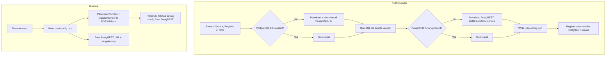

# Installer Setup: Postgres, PostgREST, and Register Config

## Overview

The NSIS installer will gain three new capabilities:

1. **Prompt the operator** for store number, register number, and role (standalone only for now)
2. **Install PostgreSQL 18 and PostgREST** natively on Windows if not already present
3. **Initialize the URSA database**, apply all schemas/migrations/demo data, and write a local config file

The Electron main process will read this config at startup and pass it to POSSUM and the Angular app.

## Architecture




## 1. NSIS installer pages (installer.nsh)

NSIS supports custom pages via `nsDialogs`. We will add a single custom page after the directory selection that collects:

- **Store Number** (text field, 1-5 digits)
- **Register Number** (text field, 1-3 digits)
- **Role** (dropdown, only "Standalone" for now; future: "ISP", "Lane")

These values get written into `$INSTDIR\resources\ursa-config.json`.

**File:** [apps/ursa-electron/installer.nsh](apps/ursa-electron/installer.nsh)

The existing `installer.nsh` already has `customInstall` macro for Java checks. We will add:

- A custom page function (`nsDialogs`-based) before `customInstall`
- PostgreSQL 18 silent install logic inside `customInstall`
- PostgREST binary download + NSSM service registration
- SQL initialization via `psql`
- Config file generation

### Config file format (`ursa-config.json`)

```json
{
  "storeNumber": "00350",
  "registerNumber": "001",
  "role": "standalone",
  "database": {
    "host": "localhost",
    "port": 5432,
    "name": "URSA",
    "user": "ursa",
    "password": "<generated>"
  },
  "postgrest": {
    "url": "http://localhost:3000"
  }
}
```

## 2. PostgreSQL 18 silent install

The installer will:

1. Check if `pg_isready` or `psql` is already on the system (common Postgres paths)
2. If missing, download the PostgreSQL 18 Windows installer (EDB MSI) from a known URL
3. Run it silently with: `--mode unattended --superpassword <generated> --serverport 5432`
4. Wait for the service to start

The generated superuser password is stored in `ursa-config.json` and also used to create the `URSA` role.

## 3. Database initialization

After PostgreSQL is confirmed running, the installer:

1. Runs `psql -f` against each SQL file in order (they are bundled as `extraResources`):
  - [infra/postgreSQL/base/000-ursa-init.sql](infra/postgreSQL/base/000-ursa-init.sql) -- schemas + tables
  - `infra/postgreSQL/base/001-*.sql` through `009-*.sql` -- reference data
  - [infra/postgreSQL/migrations/001-ursa-permissions.sql](infra/postgreSQL/migrations/001-ursa-permissions.sql) -- roles
  - Remaining migrations in order
  - [infra/postgreSQL/demo/d001-demo-org.sql](infra/postgreSQL/demo/d001-demo-org.sql) through `d008` -- demo data
2. Inserts the store/register row:
  ```sql
   INSERT INTO "STR"."Store" ("StoreNumber", "StoreName") 
   VALUES ('<storeNumber>', 'Store <storeNumber>') ON CONFLICT DO NOTHING;
   INSERT INTO "STR"."Register" ("StoreNumber", "RegisterNumber") 
   VALUES ('<storeNumber>', '<registerNumber>') ON CONFLICT DO NOTHING;
  ```

The SQL files will be bundled via a new `extraResources` entry in `package.json`.

## 4. PostgREST native install

1. Download the PostgREST Windows binary (single .exe, ~15 MB) from the GitHub releases page
2. Place it at `$INSTDIR\resources\postgrest\postgrest.exe`
3. Generate a `postgrest.conf` from the template at [infra/postgREST/postgrest.conf](infra/postgREST/postgrest.conf), substituting the real password
4. Install as a Windows service via NSSM (already downloaded by the POSSUM service script):
  - Service name: `URSA-PostgREST`
  - Startup type: Automatic

## 5. Electron main process changes

**File:** [apps/ursa-electron/src/main/main.js](apps/ursa-electron/src/main/main.js)

- At startup, read `ursa-config.json` from `process.resourcesPath` (or the app directory in dev)
- Pass `storeNumber` and `registerNumber` as environment variables to the POSSUM child process (`POSSUM_STORE_ID`, `POSSUM_WORKSTATION_ID`)
- Pass the PostgREST URL to POSSUM (`POSSUM_POSTGREST_URL`)
- Expose the config to the Angular renderer via the preload bridge so the POS app knows its own store/register identity

## 6. Package.json extraResources additions

**File:** [apps/ursa-electron/package.json](apps/ursa-electron/package.json)

Add SQL initialization files and PostgREST config template:

```json
{
  "from": "../../infra/postgreSQL",
  "to": "sql",
  "filter": ["base/*.sql", "migrations/*.sql", "demo/*.sql"]
},
{
  "from": "../../infra/postgREST",
  "to": "postgrest",
  "filter": ["postgrest.conf"]
}
```

## Files to modify

- **[apps/ursa-electron/installer.nsh](apps/ursa-electron/installer.nsh)** -- Add custom NSIS page for store/register/role, Postgres install logic, PostgREST install, DB init, config file generation
- **[apps/ursa-electron/src/main/main.js](apps/ursa-electron/src/main/main.js)** -- Read `ursa-config.json`, pass store/register to POSSUM env, expose to Angular
- **[apps/ursa-electron/src/preload/preload.js](apps/ursa-electron/src/preload/preload.js)** -- Expose `getConfig()` to renderer
- **[apps/ursa-electron/package.json](apps/ursa-electron/package.json)** -- Add SQL and PostgREST to `extraResources`
- **New: `scripts/init-ursa-db.bat**` -- Standalone batch script that runs all SQL init (can be called by the installer or run manually)

