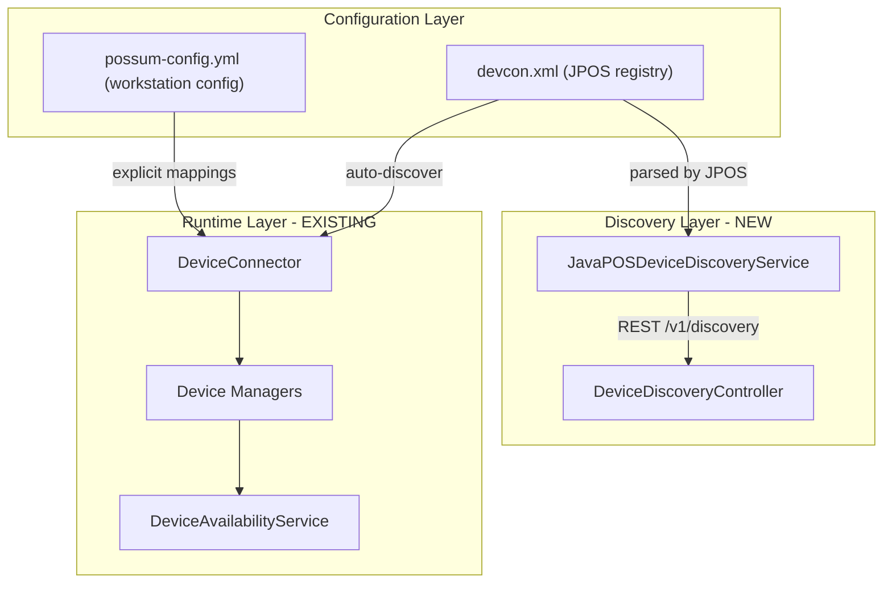

# JavaPOS Device Discovery Service + Workstation Config

## Context

POSSUM already has runtime device discovery via `DeviceConnector.getLogicalNamesForDeviceType()`, which filters entries from `devcon.xml` by category and tries each logical name until one connects. The existing `/v1/health` endpoint reports which managers are online. What's missing:

- **No way to see all configured devices** (only those that successfully connected)
- **No device testing on demand** (only at startup)
- **No explicit device mapping** (every startup re-discovers, which is slow and non-deterministic)

## Architecture




## Part 1: Device Discovery Service

New files in `src/main/java/com/target/devicemanager/common/`:

### 1a. Entity classes

`**entities/DeviceInfo.java**` -- represents a single device entry from devcon.xml:

```java
public class DeviceInfo {
    private String logicalName;     // e.g. "CashDrawer0"
    private String category;        // e.g. "CashDrawer"
    private String productName;     // e.g. "CashDrawer"
    private String description;     // from <product description="..."/>
    private String vendorName;      // from <vendor name="..."/>
    private String version;         // from <jpos version="..."/>
    private String factoryClass;    // from <creation factoryClass="..."/>
    private String serviceClass;    // from <creation serviceClass="..."/>
    private Map<String, String> properties; // all <prop> entries
    // getters, constructor
}
```

`**entities/DeviceTestResult.java**` -- result of testing a single device:

```java
public class DeviceTestResult {
    private String logicalName;
    private String category;
    private boolean functional;
    private String message;
    private long testDurationMs;
    // getters, constructor
}
```

`**entities/DeviceDiscoveryResponse.java**` -- full discovery response:

```java
public class DeviceDiscoveryResponse {
    private List<DeviceInfo> configuredDevices;
    private List<DeviceTestResult> testResults; // null if tests not run
    private String configFile;                  // path to devcon.xml used
    private Instant discoveredAt;
}
```

### 1b. Service class

`**JavaPOSDeviceDiscoveryService.java**` -- the core discovery logic:

- `scanConfiguredDevices()` -- reads the JPOS `EntryRegistry` (same one used by `DeviceConnector`) and extracts all `JposEntry` data into `DeviceInfo` objects. No hardware interaction, just XML parsing.
- `testDevice(logicalName, category)` -- attempts open/claim/enable/disable/release/close cycle (same pattern as `DeviceConnector.connect()`) and returns a `DeviceTestResult`.
- `testAllDevices()` -- runs `scanConfiguredDevices()` then tests each one, returning a `DeviceDiscoveryResponse` with both scan and test results.

Leverage the existing `JposServiceLoader.getManager().getEntryRegistry()` to access parsed entries -- no need for custom XML parsing.

### 1c. REST Controller

`**DeviceDiscoveryController.java**` -- new controller with endpoints:

- `GET /v1/discovery` -- returns all configured devices (scan only, fast)
- `GET /v1/discovery/test` -- returns all configured devices with connectivity test results (slow, runs tests)
- `GET /v1/discovery/test/{logicalName}` -- tests a single device by logical name

Add to existing `DeviceAvailabilityController` or create as a separate controller (separate is cleaner).

## Part 2: Workstation Config File (YAML)

### 2a. Config POJO

`**configuration/WorkstationConfig.java**` -- maps the YAML structure:

```java
@ConfigurationProperties(prefix = "possum")
public class WorkstationConfig {
    private StoreInfo store;
    private WorkstationInfo workstation;
    private DeviceMappings devices;
    private DiscoverySettings discovery;
    // nested classes for each section
}
```

YAML structure (`possum-config.yml`):

```yaml
possum:
  store:
    id: "store-001"
    name: "Main Street Location"
  workstation:
    id: "lane-1"
    name: "Lane 1"
  devices:
    printer: "NCRPOSPrinter-7167"
    cashDrawer: "CashDrawer0"
    flatbedScanner: "Datalogic 8200 Scanner"
    handScanner: null
    scale: "Datalogic 8405 Scale"
    lineDisplay: "NCR 5977 LineDisplay USB"
    micr: "NCR 7167 MICR"
    keylock: "Keylock0"
    posKeyboard: "POSKeyboard"
    msr: "MSR"
    toneIndicator: "ToneIndicator4"
  discovery:
    enabled: true
    testOnStartup: true
    autoAdapt: false
```

Spring Boot automatically loads `possum-config.yml` if placed alongside `application.properties`, or it can be overridden with `--spring.config.additional-location=file:/path/to/possum-config.yml`.

### 2b. Modify DeviceConnector

Add an optional `preferredLogicalName` parameter:

```java
// Current: tries all matching logical names
boolean discoverConnectedDevice()

// New overload: tries preferred name first, falls back to discovery
boolean discoverConnectedDevice(String preferredLogicalName)
```

If `preferredLogicalName` is set and `autoAdapt` is false, it ONLY tries that name (fast, deterministic). If `autoAdapt` is true, it tries the preferred name first, then falls back to scanning all matching names.

### 2c. Modify Device Config classes

Each Config class (e.g., [KeylockConfig.java](src/main/java/com/target/devicemanager/components/keylock/KeylockConfig.java)) currently creates a `DeviceConnector` with just the device and registry. Inject `WorkstationConfig` and pass the explicit logical name if configured:

```java
// Before
new DeviceConnector<>(keylock, deviceRegistry)

// After (if config has explicit mapping)
new DeviceConnector<>(keylock, deviceRegistry, null, workstationConfig.getDevices().getKeylock())
```

### 2d. Startup test-on-startup behavior

If `discovery.testOnStartup` is true, run device tests after all managers are initialized and log results. This provides early visibility into hardware issues without requiring manual API calls.

## Part 3: Management API (bonus)

Add a `POST /v1/discovery/generate-config` endpoint that runs discovery + tests and returns a ready-to-use `possum-config.yml` file content. This lets admins:

1. Hit the endpoint on a freshly set up register
2. Get back a YAML file with all detected devices filled in
3. Deploy that YAML as the explicit config for production use

## Files to Create

- `src/main/java/com/target/devicemanager/common/entities/DeviceInfo.java`
- `src/main/java/com/target/devicemanager/common/entities/DeviceTestResult.java`
- `src/main/java/com/target/devicemanager/common/entities/DeviceDiscoveryResponse.java`
- `src/main/java/com/target/devicemanager/common/JavaPOSDeviceDiscoveryService.java`
- `src/main/java/com/target/devicemanager/common/DeviceDiscoveryController.java`
- `src/main/java/com/target/devicemanager/configuration/WorkstationConfig.java`
- `src/main/resources/possum-config.yml` (default/example)

## Files to Modify

- [DeviceConnector.java](src/main/java/com/target/devicemanager/common/DeviceConnector.java) -- add `preferredLogicalName` support
- All 10 device `*Config.java` classes -- inject `WorkstationConfig`, pass explicit name
- [DeviceMain.java](src/main/java/com/target/devicemanager/DeviceMain.java) -- optionally trigger test-on-startup

## Dependencies

No new dependencies needed. YAML parsing is already available via `jackson-dataformat-yaml:2.19.0` and `snakeyaml:2.4` in [build.gradle](build.gradle). The JPOS entry registry is already used by all Config classes.