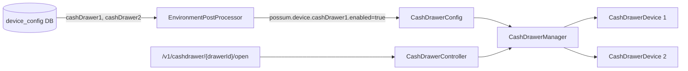

# Multi-Drawer Cash Drawer Support (1–4)

## Design: Follow the Scanner Pattern

The scanner holds a `List<ScannerDevice>` in a single `ScannerManager`. Cash drawers will do the same: one `CashDrawerManager` bean holds a `Map<Integer, CashDrawerDevice>` (slot 1–4), connected and scheduled as a unit.



## DB Schema

Each drawer slot is a separate row in the existing `device_config` table. No schema change needed:

```sql
-- Example: register has drawer 1 (NCR) and drawer 2 (ELO)
INSERT INTO device_config VALUES ('001', '1', 'cashDrawer1', 'CashDrawer_NCR');
INSERT INTO device_config VALUES ('001', '1', 'cashDrawer2', 'CashDrawer_ELO');
```

Valid `device_type` values: `cashDrawer1`, `cashDrawer2`, `cashDrawer3`, `cashDrawer4`.

The `DeviceConfigEnvironmentPostProcessor` already handles these automatically — it injects whatever device types it finds in the DB.

## REST API Changes

Current (single drawer, no path variable):

```
POST /v1/cashdrawer/open
POST /v1/cashdrawer/reconnect
GET  /v1/cashdrawer/health
GET  /v1/cashdrawer/healthstatus
```

New (drawer number in path, backward-compatible default to drawer 1):

```
POST /v1/cashdrawer/{drawerId}/open        (drawerId = 1..4)
POST /v1/cashdrawer/{drawerId}/reconnect
GET  /v1/cashdrawer/{drawerId}/health
GET  /v1/cashdrawer/{drawerId}/healthstatus
GET  /v1/cashdrawer/health                 (all drawers — returns List<DeviceHealthResponse>)
```

---

## Files to Change

### 1. [`CashDrawerManager.java`](src/main/java/com/target/devicemanager/components/cashdrawer/CashDrawerManager.java)

Change from a single `CashDrawerDevice` to a `Map<Integer, CashDrawerDevice>` (slot → device). All operations accept a `drawerId` (1–4):

```java
// Constructor changes
public CashDrawerManager(Map<Integer, CashDrawerDevice> cashDrawerDevices, Lock cashDrawerLock)

// connect() still @Scheduled — iterates all devices
@Scheduled(fixedDelay = 5000, initialDelay = 5000)
public void connect() {
    for (CashDrawerDevice device : cashDrawerDevices.values()) { ... }
}

// Operations now take drawerId
public void openCashDrawer(int drawerId) throws DeviceException
public void reconnectDevice(int drawerId) throws DeviceException
public DeviceHealthResponse getHealth(int drawerId)
public DeviceHealthResponse getStatus(int drawerId)
public List<DeviceHealthResponse> getAllHealth()
```

Cache key per drawer: `"cashDrawer" + drawerId + "Health"` (e.g. `cashDrawer1Health`).

### 2. [`CashDrawerConfig.java`](src/main/java/com/target/devicemanager/components/cashdrawer/CashDrawerConfig.java)

Change `@ConditionalOnProperty` to `@ConditionalOnExpression` (any of the 4 slots enabled). Build the device map iterating slots 1–4:

```java
@ConditionalOnExpression(
    "'${possum.device.cashDrawer1.enabled:false}' == 'true' or " +
    "'${possum.device.cashDrawer2.enabled:false}' == 'true' or " +
    "'${possum.device.cashDrawer3.enabled:false}' == 'true' or " +
    "'${possum.device.cashDrawer4.enabled:false}' == 'true'")
class CashDrawerConfig {
    ...
    @Bean
    public CashDrawerManager getCashDrawerManager() {
        Map<Integer, CashDrawerDevice> devices = new LinkedHashMap<>();
        for (int i = 1; i <= 4; i++) {
            String key = "cashDrawer" + i;
            if ("true".equals(environment.getProperty("possum.device." + key + ".enabled"))) {
                String preferred = environment.getProperty("possum.device." + key + ".logicalName");
                // create DynamicDevice + CashDrawerDevice for this slot
                devices.put(i, ...);
            }
        }
        CashDrawerManager mgr = new CashDrawerManager(devices, new ReentrantLock());
        DeviceAvailabilitySingleton...setCashDrawerManager(mgr);
        return mgr;
    }
}
```

In simulation mode: put a single simulated device at slot 1.

### 3. [`CashDrawerController.java`](src/main/java/com/target/devicemanager/components/cashdrawer/CashDrawerController.java)

Add `{drawerId}` path variable, validate it is 1–4, route to manager:

```java
@PostMapping("/{drawerId}/open")
public void openCashDrawer(@PathVariable int drawerId) throws DeviceException { ... }

@PostMapping("/{drawerId}/reconnect")
public void reconnect(@PathVariable int drawerId) throws DeviceException { ... }

@GetMapping("/{drawerId}/health")
public DeviceHealthResponse getHealth(@PathVariable int drawerId) { ... }

@GetMapping("/{drawerId}/healthstatus")
public DeviceHealthResponse getStatus(@PathVariable int drawerId) { ... }

@GetMapping("/health")        // all drawers
public List<DeviceHealthResponse> getAllHealth() { ... }
```

Update `@ConditionalOnExpression` to match `CashDrawerConfig`.

### 4. [`CashDrawerSimulatorController.java`](src/main/java/com/target/devicemanager/components/cashdrawer/simulator/CashDrawerSimulatorController.java)

Add `{drawerId}` to simulator endpoints:

```java
@PostMapping(path = "{drawerId}/cashdrawerStatus")
@PostMapping(path = "{drawerId}/cashdrawerState")
```

Update `@ConditionalOnExpression` to match.

### 5. [`DeviceAvailabilitySingleton.java`](src/main/java/com/target/devicemanager/common/DeviceAvailabilitySingleton.java)

No structural change — still holds one `CashDrawerManager` bean. The manager itself now contains all drawers internally. `DeviceAvailabilityService.getHealth()` already null-checks before calling `getHealth()` on the manager, which now returns all drawers.

### 6. [`DeviceAvailabilityService.java`](src/main/java/com/target/devicemanager/common/DeviceAvailabilityService.java)

In `getHealth()`, change single drawer health call to call `cashDrawerManager.getAllHealth()` and add all results to the response list.

---

## No Changes Needed

- `CashDrawerDevice.java` — unchanged, each slot gets its own instance as before
- `DeviceConfigEnvironmentPostProcessor.java` — already handles any `device_type` key generically; `cashDrawer1`–`cashDrawer4` work automatically
- DB table — no schema change; just new device type string values